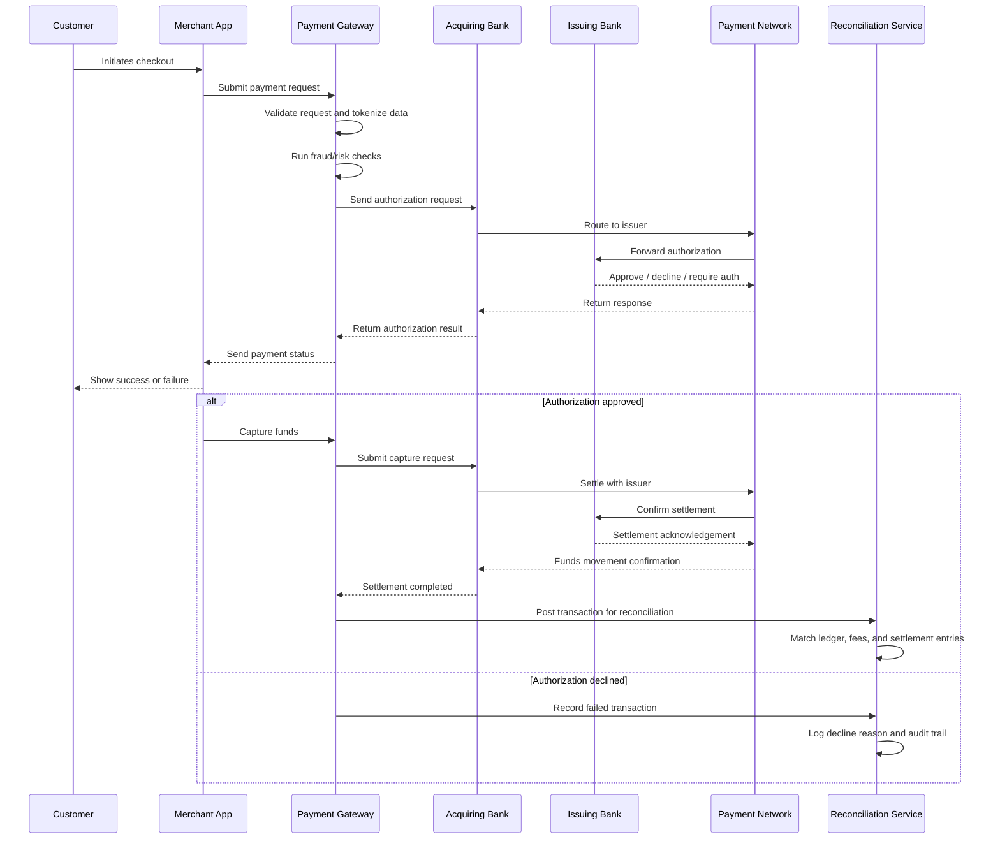
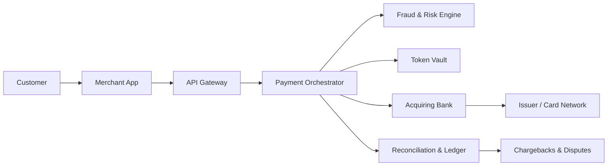
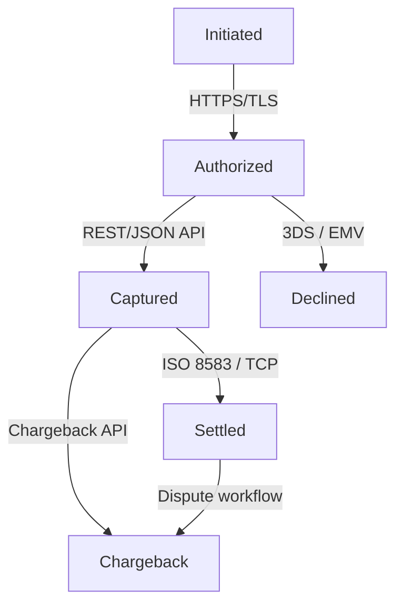

# Payment Gateway Workflow for the Banking Domain

This document describes a reference workflow for a payment gateway used in banking and financial services. It covers the end-to-end lifecycle of a digital payment, including authorization, settlement, reconciliation, and exception handling.

## 1. Overview

A payment gateway acts as the secure bridge between:
- the merchant application,
- the acquiring bank,
- the issuing bank,
- and the payment network.

Its role is to capture payment credentials, validate the transaction, route it to the appropriate bank, and return the final status to the merchant.

## 2. Core Actors

- Customer: initiates the payment using a card, wallet, or bank transfer.
- Merchant: offers goods or services and requests payment.
- Payment Gateway: collects transaction data, performs security checks, and routes the transaction.
- Acquiring Bank: processes the merchant’s payment requests.
- Issuing Bank: approves or declines the customer’s transaction.
- Payment Network: provides the switching and settlement infrastructure.
- Risk & Fraud Engine: evaluates anomalies and suspicious behavior.
- Reconciliation Engine: matches settlement and transaction records.

## 3. End-to-End Workflow

## 4. Detailed Payment Lifecycle

### Stage 1: Order creation and checkout
The merchant creates an order and sends the customer to the payment page. The payment request includes amount, currency, merchant reference, and customer context.

### Stage 2: Payment initiation
The customer selects a payment method such as card, wallet, or bank transfer. The merchant submits the init request to the gateway with the required order details.

### Stage 3: Pre-authorization validation
The gateway validates the request, confirms merchant credentials, checks the amount and currency, and prepares the transaction for secure routing.

### Stage 4: Security and fraud screening
Sensitive payment data is encrypted or tokenized. The gateway and fraud engine then assess the transaction for anomalies, velocity, device risk, or geo mismatch.

### Stage 5: Authorization
The gateway sends an authorization request to the acquiring bank. The request is routed through the payment network to the issuing bank, which validates the customer’s account and returns an approval or decline.

### Stage 6: Post-authorization handling
If approved, the merchant may capture the funds. If declined, the workflow stops and the merchant returns a failure response to the customer.

### Stage 7: Capture and settlement
After authorization, the transaction is captured and settled. Funds are moved from the customer’s issuing bank to the merchant’s acquiring bank account, and settlement entries are recorded.

### Stage 8: Reconciliation and reporting
The gateway and reconciliation engine compare:
- authorization records,
- capture records,
- settlement records,
- fees,
- refunds,
- chargebacks.

### Stage 9: Refunds, reversals, and disputes
The lifecycle continues beyond the initial success. Refunds, reversals, chargebacks, and disputes must be processed and reflected in the ledger and reporting systems.

### Stage 10: Monitoring and audit
All financial steps are logged for audit, compliance, and operational monitoring. This supports investigations, dispute handling, and regulatory reporting.

## 5. Architecture Diagram

The following Mermaid diagram represents the core architecture of the payment gateway:

## 6. Transaction Lifecycle State Diagram

The following Mermaid diagram shows the main payment states and the transitions that occur during a transaction lifecycle:

### Protocols used between entities and components

- Customer to Merchant: HTTPS/TLS over browser or mobile app requests
- Merchant to Gateway: REST/JSON or SOAP APIs with OAuth2/JWT authentication
- Gateway to Acquirer: ISO 8583, ISO 20022, or proprietary banking message formats
- Acquirer to Issuer/Network: EMV, 3DS, and card-network message protocols
- Gateway to Reconciliation/Reporting: HTTPS/TLS with asynchronous events or file-based settlement feeds
- Internal services: AMQP/Kafka-based messaging for event propagation and audit trails

## 7. Detailed Process

### Step 1: Payment initiation
The customer selects a payment method and submits the transaction from the merchant checkout page.

### Step 2: Request validation
The merchant sends the payment request to the gateway. The gateway validates:
- merchant identity,
- order amount,
- currency,
- transaction timestamp,
- required fields.

### Step 3: Security controls
The gateway applies security controls before sending the transaction onward:
- encryption of card or payment data,
- tokenization for sensitive data,
- TLS protection,
- 3D Secure or strong customer authentication when required.

### Step 4: Fraud and risk analysis
The gateway or a connected fraud engine evaluates the transaction for:
- velocity checks,
- geolocation mismatch,
- unusual device fingerprint,
- blacklisted IP addresses,
- velocity and spend anomalies.

### Step 5: Authorization request
Once the transaction passes pre-checks, the gateway sends an authorization request to the acquiring bank.

### Step 6: Bank authorization flow
The acquiring bank forwards the request to the issuing bank through the relevant payment network.
The issuing bank checks:
- available funds,
- card status,
- CVV or authentication result,
- rules and limits.

### Step 7: Response handling
The issuer returns one of the following outcomes:
- approved,
- declined,
- referral,
- timeout,
- authentication required.

The gateway relays the response to the merchant application.

### Step 8: Capture and settlement
If authorized, the merchant can capture the funds and submit a settlement request. The acquiring bank then settles the transaction with the issuer and transfers funds to the merchant account.

### Step 9: Reconciliation
The gateway reconciles:
- transaction status,
- settlement status,
- fees and commissions,
- chargebacks and refunds,
- disputes.

### Step 10: Exceptions and post-processing
The system handles exceptions such as:
- partial authorizations,
- retries,
- timeouts,
- chargebacks,
- refunds,
- disputes.

## 8. Banking-Specific Considerations

- PCI DSS compliance for cardholder data handling.
- Tokenization to reduce exposure of raw card data.
- Strong Customer Authentication for regulated transactions.
- Dual control and audit logging for financial operations.
- Support for settlement windows, fee calculations, and reconciliation rules.
- Handling of chargebacks, reversals, and dispute management.

## 9. Recommended Architecture Components

- API layer for merchant integration
- Payment orchestration service
- Risk engine
- Token vault
- Message broker for async processing
- Ledger and settlement service
- Reconciliation service
- Audit and monitoring dashboard

## 10. Success Criteria

A robust banking payment gateway should provide:
- high availability,
- secure transaction handling,
- fast authorization response times,
- reliable settlement processing,
- comprehensive audit trails,
- support for refunds and chargebacks.
